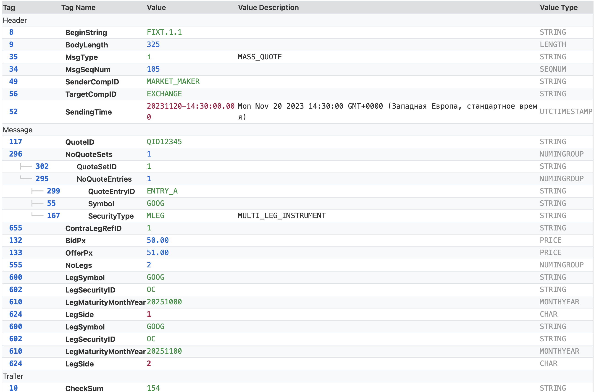
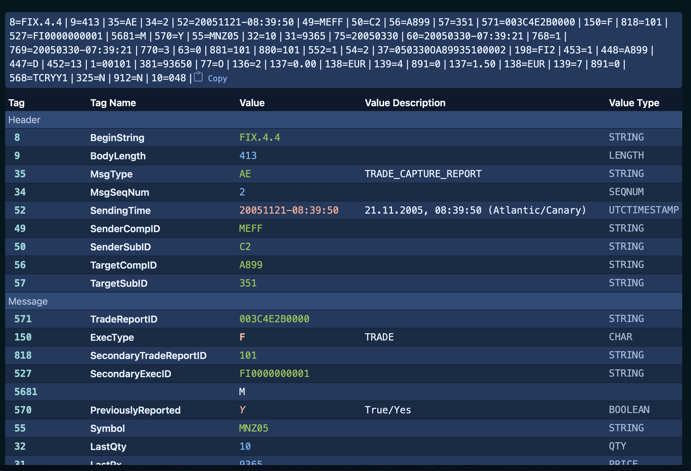
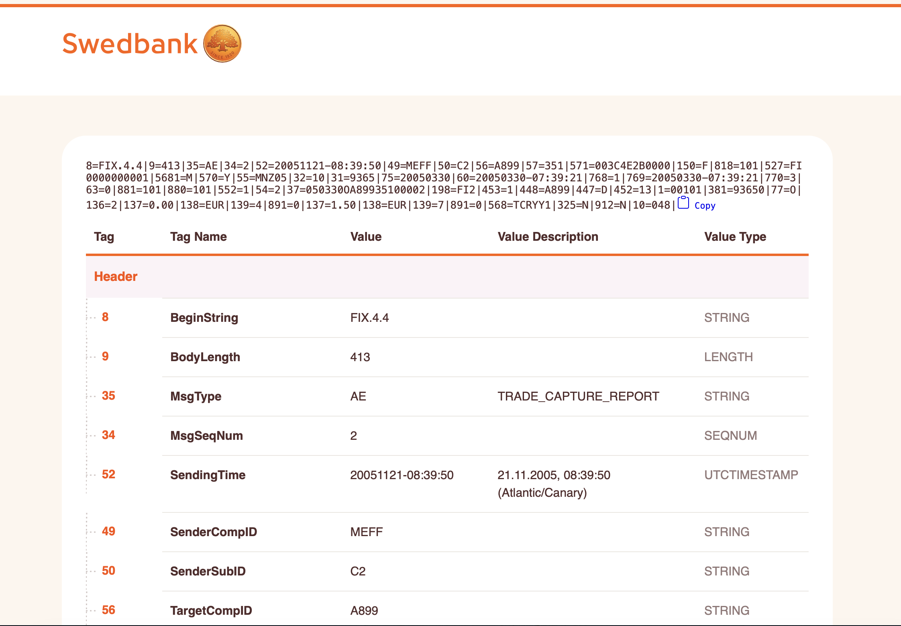

<div align="center">
    
</div>

# FIX Message Web Component

This is a web component for displaying FIX ([Financial Information eXchange](https://en.wikipedia.org/wiki/Financial_Information_eXchange)) messages. It can render a FIX message as either a simple delimited string or a detailed, human-readable table.

The component parses FIX messages and enriches them with data from a FIX dictionary, providing tag names, value descriptions, and other useful information.

### Key Features:

*   **Two Display Modes**: View FIX messages as a raw string with custom delimiters or as a comprehensive HTML table.
*   **Hierarchical Group Display**: Repeating groups are displayed in an indented, tree-like structure, making complex messages with nested components much easier to read.
*   **FIX Dictionary Support**: Automatically uses the appropriate FIX dictionary based on the message version. It supports FIX versions 4.0 through 5.0 SP2.
*   **Checksum Validation**: Automatically validates the message checksum and displays the result.
*   **Data Enrichment**: Automatically describes values for common data types, including:
    *   Converting UTC and zoned timestamps to the user's local time.
    *   Displaying full names for currencies, countries, languages, and exchanges based on ISO standards.
*   **Customizable**: Control the appearance and parsing with attributes like `message`, `delimiter`, and `mode`.
*   **Intelligent Version Detection**: Automatically detects the data dictionary version from the message content when using FIXT 1.1.
*   **Color-Coded Data Types**: The table view uses different colors for various data types (string, integer, float, etc.) to improve readability.

Demo FIX message decoder can be found here https://fix-decoder.samkov.ee

[](https://github.com/SamKirkland/FTP-Deploy-Action)




## Usage

Watch a quick video tutorial on YouTube:
[](https://www.youtube.com/watch?v=Smyy3JWhHwc)

To use the `fix-message` component, you need to include the `fix-message.mjs` script in your HTML file and then use the `<fix-message>` tag. The component will automatically render repeating groups in a tree-like structure.

```html
<!DOCTYPE html>
<html>
<head>
    <title>FIX Message Viewer</title>
    <script type="module" src="src/fix-message.mjs"></script>
</head>
<body>

<h1>FIX Message Display</h1>

<fix-message
        message="8=FIX.4.2|9=170|35=E|73=2|11=LIST1|55=EUR/USD|54=1|38=100|40=2|68=2|11=ORDER1|54=1|38=50|40=1|11=ORDER2|54=2|38=50|40=2|10=161"
        mode="table"
        delimiter="|"
></fix-message>

</body>
</html>
```

### Attributes

*   `message`: The FIX message string to be displayed. The default delimiter is the SOH character (ASCII 1).
*   `delimiter`: The delimiter used in the `message` string. The default is `|`.
*   `mode`: The display mode. Can be `string` or `table`. If not specified, it will render as a string.
*   `data-dictionary`: (Optional) The path to a custom data dictionary XML file. If not provided, the component will use the built-in dictionaries based on the message's `BeginString(8)` value. The format should be the same as the QuickFixJ XML dictionary format.
*   `use-host-dom`: (Optional) If present, the component will render directly into the host element's DOM instead of its shadow DOM. This is useful for applying global styles.

## Examples

### Default Mode (String)
If you don't specify a `mode`, the component will render the FIX message as a simple string with the specified delimiter. This is useful for quickly displaying the raw message.

```html
<fix-message
    message="8=FIX.4.2|9=123|35=D|..."
    delimiter="|"
></fix-message>
```

### Table Mode
The `table` mode provides a detailed, human-readable view of the FIX message, with each tag-value pair on its own row. This is ideal for analysis and debugging. Repeating groups will be automatically indented.

```html
<fix-message
    message="8=FIX.4.2|9=170|35=E|73=2|11=LIST1|...|68=2|11=ORDER1|...|11=ORDER2|...|10=161"
    mode="table"
    delimiter="|"
></fix-message>
```

### Using SOH Separator
FIX messages often use the non-printable Start of Header (SOH) character (`\x01`) as a delimiter. You can pass the message in this format and the component will parse it correctly.

```html
<fix-message
    message="8=FIX.4.29=12335=D..."
    mode="table"
></fix-message>
```

### Using a Custom Dictionary
For proprietary FIX implementations or custom tags, you can provide a path to your own dictionary file. This is useful when working with non-standard FIX messages. The dictionary file should be in the QuickFixJ XML format.

```html
<fix-message
    message="8=FIXT.1.1|9=123|35=W|...|9000=CUSTOM_VALUE"
    mode="table"
    delimiter="|"
    data-dictionary="/path/to/your/custom-fix-dictionary.xml"
></fix-message>
```

### Styling with CSS Variables (Shadow DOM)
When using the default Shadow DOM encapsulation, you can customize the component's appearance by overriding its CSS custom properties.

```html
<style>
    fix-message {
        --font-family: "Georgia", serif;
        --tag-color: #9C27B0;
        --string-value-color: #4CAF50;
        --background-color: #222;
        --font-color: #eee;
        --border-color: #555;
        --indent-step: 40px; /* Make indentation wider */
    }
</style>
```
See the example: [blue style](examples/blue-style.html)


Here is a list of the available CSS variables:

| Variable                | Description                                          | Default Value                                           | Color                                                                                                   |
|-------------------------|------------------------------------------------------|---------------------------------------------------------|---------------------------------------------------------------------------------------------------------|
| `--font-size`           | The base font size for the table.                    | `14px`                                                  |                                                                                                         |
| `--font-family`         | The primary font for text content.                   | `-apple-system, BlinkMacSystemFont, "Segoe UI", ...`     |                                                                                                         |
| `--font-monospace`      | The font for monospace content like tags and values. | `'Consolas', 'Menlo', 'Courier New', monospace`         |                                                                                                         |
| `--indent-step`         | The indentation width for each level in a nested group.| `25px`                                                  |                                                                                                         |
| `--font-color`          | The main text color.                                 | `#000E24`                                               |                    |
| `--background-color`    | The default background color.                        | `#FFF`                                                  |                    |
| `--even-backgroud-color`| The background color for even-numbered rows.         | `#E5F0FF`                                               |                    |
| `--header-font-color`   | The font color for table headers.                    | `#E5F0FF`                                               |                    |
| `--header-background-color`| The background color for table headers.           | `#013A63`                                               |                    |
| `--section-font-color`  | The font color for section headers.                  | `#E5F0FF`                                               |                    |
| `--section-background-color`| The background color for section headers.         | `#66A3FF`                                               |                    |
| `--border-color`        | The color for table borders.                         | `#CCE0FF`                                               |                    |
| `--tree-color`          | The color of the tree-like decorations for nested groups. | `#cccccc`                                             |                    |
| `--tag-color`           | The color for the tag number column.                 | `#0366d6`                                               |                    |
| `--string-value-color`  | The color for string data types.                     | `#269141`                                               |                    |
| `--integer-value-color` | The color for integer data types.                    | `#0366d6`                                               |                    |
| `--float-value-color`   | The color for float/decimal data types.              | `#0366d6`                                               |                    |
| `--char-value-color`    | The color for character data types.                  | `#a61945`                                               |                    |
| `--boolean-value-color` | The color for boolean data types.                    | `#a61945`                                               |                    |
| `--datetime-value-color`| The color for date and time data types.              | `#a61945`                                               |                    |
| `--type-color`          | The color for the data type column.                  | `#999`                                                  |                    |
| `--value-color`         | The default color for values in the table.           | `var(--font-color)`                                     |                    |


### Styling with Host CSS (`use-host-dom`)
If you want to apply your own global CSS styles to the component, you can use the `use-host-dom` attribute. This will render the component in the main document's DOM, allowing your stylesheets to apply. This is useful for integrating the component seamlessly into your application's design.

```html
<style>
    /* Example: Custom styles for the table */
    fix-message table {
        border: 2px solid blue;
    }
</style>

<fix-message
    message="8=FIX.4.2|9=123|35=D|..."
    mode="table"
    delimiter="|"
    use-host-dom
></fix-message>
```
See the example: [Swedbank style](examples/swedbank-style.html)



## Custom Events

The `fix-message` component emits a `rendered` event after it has finished rendering the FIX message. This can be useful for performing actions after the component has been updated.

```javascript
const fixMessageElement = document.querySelector('fix-message');
fixMessageElement.addEventListener('rendered', () => {
    console.log('FIX message has been rendered.');
});
```

The `fix-message` component also emits a `copied` event when the FIX message has been copied to the clipboard. This can be useful for displaying information about the copy-to-clipboard action to the user in your framework’s style.

```javascript
const fixMessageElement = document.querySelector('fix-message');
fixMessageElement.addEventListener('copied', () => {
    alert('FIX message has been copied to the clipboard.');
});
```

## Data Modules

The component uses several data modules to enrich the displayed FIX message. These modules are located in the `src` directory and can be customized if needed.

*   `src/currencies.mjs`: A list of currencies based on the ISO 4217 standard.
*   `src/countries.mjs`: A list of countries based on the ISO 3166-1 standard.
*   `src/exchanges.mjs`: A list of exchanges based on the ISO 10383 Market Identifier Code (MIC) standard.
*   `src/languages.mjs`: A list of languages based on the ISO 639-1 standard.

## License

This project is licensed under the MIT License. See the [LICENSE](src/LICENSE.txt) file for details.
