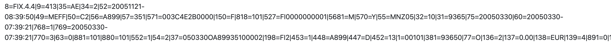
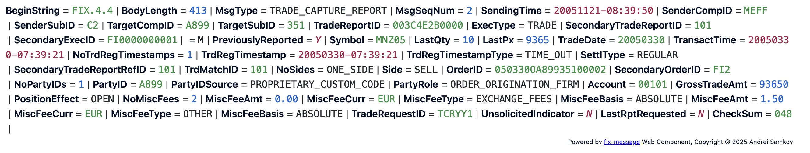
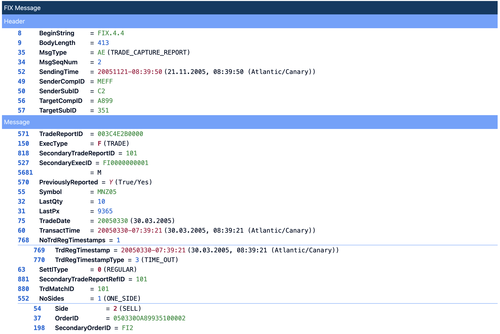
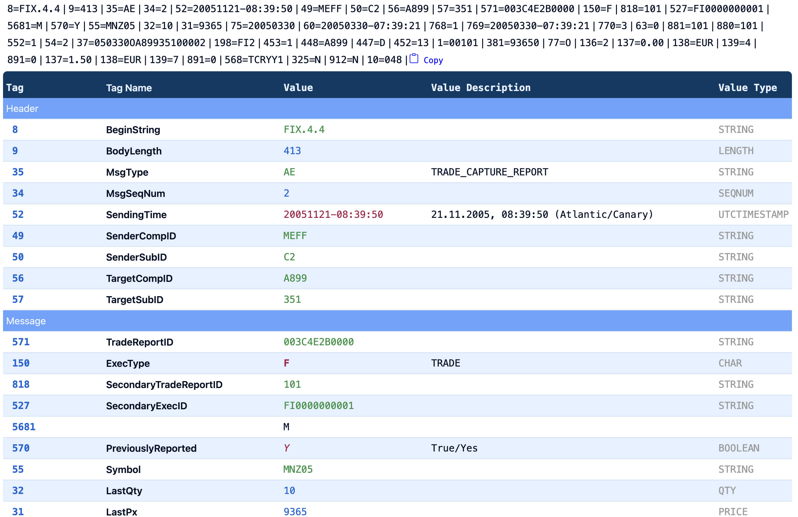

# Display Modes

The `fix-message` web component offers several display modes to suit different use cases. You can set the desired mode using the `mode` attribute on the component.

## String Mode (`mode="string"`)

The `string` mode is the **default** and simplest display option. It renders the entire FIX message as a single, continuous string, using the specified delimiter to separate the tag-value pairs. This mode is ideal for quickly displaying the raw message without any special formatting.

**Example:**
```html
<fix-message
    message="8=FIX.4.2|9=123|35=D|..."
    mode="string"
    delimiter="|"
></fix-message>
```

**Screenshot:**


---

## Compact Mode (`mode="compact"`)

The `compact` mode is a space-saving alternative to the `string` mode. It replaces tag numbers with tag names and enum values with their corresponding value names. The message has visual formatting (coloring) and shows tooltips with descriptions. This mode is useful to save space when showing messages inline.

**Example:**
```html
<fix-message
    message="8=FIX.4.2|9=170|35=E|..."
    mode="compact"
    delimiter="|"
></fix-message>
```

**Screenshot:**


---

## List Mode (`mode="list"`)

The `list` mode renders the FIX message as a simple, unstyled HTML list (`<ul>` and `<li>` tags). Each tag-value pair is displayed as a separate list item. This mode is useful for developers who want a basic structure to which they can apply their own custom styling.

**Example:**
```html
<fix-message
    message="8=FIX.4.2|9=123|35=D|..."
    mode="list"
    delimiter="|"
></fix-message>
```

**Screenshot:**


---

## Table Mode (`mode="table"`)

The `table` mode provides the most detailed and human-readable view of the FIX message. Each tag-value pair is displayed on its own row, with columns for the tag, tag name, value, value description, and data type. This mode is ideal for in-depth analysis and debugging, as it also displays enriched data, such as checksum validation and human-readable names for codes.

**Example:**
```html
<fix-message
    message="8=FIX.4.2|9=170|35=E|..."
    mode="table"
    delimiter="|"
></fix-message>
```

**Screenshot:**


## Video tutorial

Watch a quick video tutorial on YouTube: https://youtu.be/iOZ4hYUwWoc
[](https://www.youtube.com/watch?v=iOZ4hYUwWoc)
